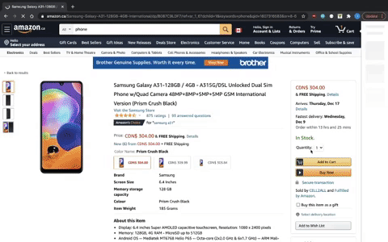

# Offset

Offset is a Chrome Extension that helps users offset their carbon footprints!
At the checkout of a purchase, clicking the Offset extension calculates a personalized donation amount to offset the carbon footprint created by your purchase, and provides a direct link to an environmental charity.

To install this extension:

Download these files.

Navigate to chrome://extensions, make sure that the Developer mode switch is turned on in the upper right, and click Load Unpacked. Then select the appropriate directory (the dist directory containing manifest.json);

If it worked you should see an icon for the Offset Chrome extension.

Removing the extension:

To remove the extension, click Remove on the extension page, or use the Remove from Chrome... menu option when right clicking the icon.

